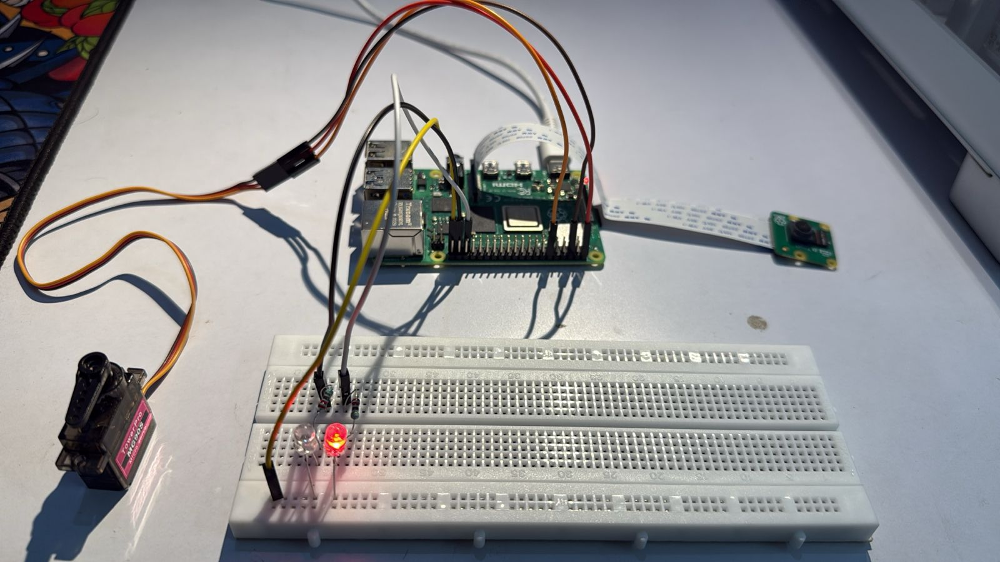

# Real-Time IoT Based Face Recognition and Authentication System

## 📌 Project Overview

This project is a **Real-Time IoT-based Face Recognition and Authentication System** that integrates **face recognition**, **email alerts**, **Adafruit IO**, and **servo control** to create a smart surveillance and access control solution. It identifies faces in real-time and grants/denies access accordingly, while notifying the user and updating data on Adafruit IO.

## 🛠️ Features

* Real-time video streaming from Raspberry Pi camera.
* Face recognition using the `face_recognition` library.
* Sends images and status to **Adafruit IO** (known and unknown feeds).
* Controls a **servo motor** to unlock/lock based on recognition.
* Sends **email alerts** for both known and unknown persons.
* LEDs for visual indication of access status (Green: Access, Red: Denied).

---

## 📦 Requirements

### 🐍 Python Libraries to Install

Install the following Python libraries using `pip`:

```bash
pip install opencv-python face_recognition numpy adafruit-io Pillow
```

Additional for Raspberry Pi:

```bash
sudo apt install python3-opencv
sudo pip3 install RPi.GPIO picamera2
```

### 🧰 Library Breakdown

* `opencv-python`: For image/video processing and display.
* `face_recognition`: For detecting and recognizing faces using dlib.
* `numpy`: Required for matrix operations and image buffers.
* `adafruit-io`: To send and receive data from Adafruit IO.
* `Pillow`: For converting frames to image format (used with `BytesIO`).
* `RPi.GPIO`: Used for controlling Raspberry Pi GPIO pins (LEDs, Servo).
* `picamera2`: Library for interfacing with the Pi Camera.
* `smtplib` & `email.message`: For sending email alerts.
* `socket`: Enables communication between client (camera) and server (face recognition). Used for real-time frame transfer.

Also, enable the following on Raspberry Pi:

* Camera Interface
* I2C / GPIO (for servo + LEDs)

### 🔧 Hardware Requirements

* Raspberry Pi 4B
* Pi Camera Module
* Servo Motor
* Green LED
* Red LED
* 6 Jumper Wires
* 2 Resistors (120 ohm)
* Breadboard

**Hardware Setup Notes:**

* Connect Servo Motor to GPIO pin 18
* Connect Green LED to GPIO 26 (with 120 ohm resistor)
* Connect Red LED to GPIO 19 (with 120 ohm resistor)
* Use the breadboard and jumper wires for interconnection

---

## 📁 Folder Structure

```
Real-Time-IOT-Based-Face-Recognition-and-Authentication-System/
├── known_faces/             # Folder with images of known individuals
├── unknown_faces/           # Saved snapshots of unknown individuals
├── CLIENT.py                # Raspberry Pi camera client script
├── MAIN.py                  # Server-side script for face recognition
├── LOCK_UNLOCK.py           # Script to control servo lock based on Adafruit IO feed
├── DATA_FEED.py             # Handles communication with Adafruit IO
└── README.md
```

---

## 🔧 Setup Instructions

### Step 1: Set Up Known Faces

* Create a folder named `known_faces` and place images of known individuals.
* The filename (excluding extension) will be treated as the person's name.

### Step 2: Adafruit IO Setup

* Create an account at [https://io.adafruit.com](https://io.adafruit.com)
* Create 3 feeds:

  * `lock` (Integer feed for controlling lock status)
  * `known` (Image feed for known individuals)
  * `unknown` (Image feed for unknown individuals)
* Replace your `ADAFRUIT_IO_USERNAME` and `ADAFRUIT_IO_KEY` in `DATA_FEED.py` and `LOCK_UNLOCK.py`

### Step 3: Email Setup (Optional)

* Update sender email, receiver email, and app password in `send_email_alert()` in `MAIN.py`

### Step 4: Hardware Setup

* Connect Raspberry Pi Camera Module.
* Connect Servo Motor to GPIO pin 18.
* Connect LEDs:

  * Green LED to GPIO 26
  * Red LED to GPIO 19
* Use 120 ohm resistors in series with each LED.
* Connect all components via a breadboard using jumper wires.

---

## 🚀 How to Run

### 1. On Raspberry Pi (Client)

```bash
python3 CLIENT.py
```

This will start capturing and sending frames to the server.

### 2. On Server (Face Recognition + Adafruit IO)

```bash
python3 MAIN.py
```

### 3. On Raspberry Pi (Lock Control Unit)

```bash
python3 LOCK_UNLOCK.py
```

---

## 🧱 System Architecture


This diagram illustrates how the client (Raspberry Pi with PiCamera) communicates with the server via sockets. The server performs face recognition, controls LEDs and servo motors. Based on recognition, the system either grants or denies access, with email alerts for unknown individuals.


## 🖼️ Output & Demo

* 🎥 **Live Video Window**: With real-time face detection and names.
* 🔐 **Servo Unlocks**: When a known face is detected.
* ❌ **Email Alerts + Image Upload**: If an unknown face is detected.
* 🛁 **Adafruit IO Dashboard**: Visual feed of known and unknown face snapshots.

---
### Visual Indicators

- ✅ **Green LED ON and Servo Motor rotates at Angle 90°** (Access Granted):
  

- ❌ **Red LED ON and Servo Motor remains at Base Angle 0°** (Access Denied):
  

  ---

## ✅ Use Cases

* Smart Door Lock Systems
* Attendance Systems
* Security Systems for Home and Offices
* IoT-based Remote Surveillance

---

## 📌 Notes

* Ensure stable internet connection on Raspberry Pi for Adafruit IO communication.
* Adjust face recognition `tolerance` in `MAIN.py` for more strict/relaxed matching.
* Proper lighting improves face detection accuracy.

